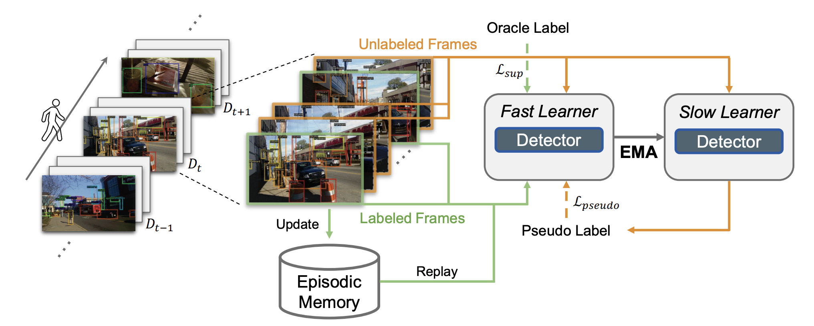

# Effcient-CLS

This repository is the official implementation of the following paper:

**[Label-Efficient Online Continual Object Detection in Streaming Video](https://arxiv.org/abs/2206.00309)**
<br/>
[Jay Zhangjie Wu](https://zhangjiewu.github.io/), 
[David Junhao Zhang](https://junhaozhang98.github.io/), 
[Wynne Hsu](https://www.comp.nus.edu.sg/~whsu/), 
[Mengmi Zhang](https://a0091624.wixsite.com/deepneurocognition-1), 
[Mike Zheng Shou](https://sites.google.com/view/showlab)
<br/>

<p align="center">
  
</p>


## Setup

### Installation

Clone the repository and install the dependencies:

```bash
git clone https://github.com/showlab/Efficient-CLS.git
pip install Efficient-CLS/requirements.txt
python -m pip install -e Efficient-CLS
```

### Datasets

We provide the processed datasets in the Google Drive ([OAK](https://drive.google.com/file/d/1TewbRDPhutTDHT5vl_0hE30hotZqcffV/view?usp=sharing), [EgoObjects](https://drive.google.com/file/d/10d0XSS5G_HW4P8ptVh7k-PT50Phmb3XN/view?usp=sharing)). Download the datasets and modify the `DATA_DIR` in `configs/efficient_cls.yaml` to the corresponding directory.

### Pretrained Models

We use Faster R-CNN on PASCAL VOC object detection. Run the following commands to download the pretrained weights in [Detectron2 Model Zoo](https://github.com/facebookresearch/detectron2/blob/main/MODEL_ZOO.md#cityscapes--pascal-voc-baselines). 

```bash
mkdir weights && wget https://dl.fbaipublicfiles.com/detectron2/PascalVOC-Detection/faster_rcnn_R_50_C4/142202221/model_final_b1acc2.pkl -P weights/
```

## Usage

To start training, run this:
```bash
# E.g., run experiment on OAK dataset at 4/16 annotation cost, with 12/16 unlabeled data trained with pseudo labels.
python train.py --exp=train --dataset=oak --num_oracle=4 --num_pseudo=12 --replay_size=16
```

## Shoutouts

- This code builds on [detectron2](https://github.com/facebookresearch/detectron2). Thanks for opensourcing!
- Thanks the contributors of [OAK](https://oakdata.github.io/) and [EgoObjects](https://ai.meta.com/datasets/egoobjects-downloads/) for sharing the datasets!


